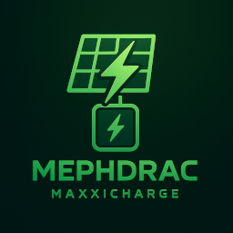

# MaxxiChargeConnect


MaxxiChargeConnect ist eine benutzerdefinierte Home Assistant Integration, die das MaxxiCharge-System von Maxxisun unterstützt. Die Integration empfängt Statuswerte über einen lokalen Webhook und stellt sie in Home Assistant als Sensoren bereit.

## 📌 Hinweis

Diese Integration wurde nicht von Maxxisun oder der Maxxi GmbH entwickelt oder unterstützt.
Ich, @mephdrac, stehe in keinerlei Verbindung zur Maxxi GmbH. Die Verwendung der Begriffe MaxxiCharge und Maxxisun dient ausschließlich der Beschreibung der Kompatibilität.

## ✅ Funktionen
Empfang von Daten über einen lokalen Webhook

- Darstellung folgender Informationen:
- Gerätedaten (ID, Firmware-Version)
- WiFi-Signalstärke
- Ladeleistung (CCU, PV, Batterie)
- Ladezustand in Wh und %

Icons & Device Class für Home Assistant optimiert

## 🚫 Haftungsausschluss
Diese Software wird ohne jegliche Gewährleistung bereitgestellt.
Die Nutzung erfolgt auf eigene Gefahr. Ich übernehme keine Haftung für:

Schäden an Hardware oder Software

Datenverluste

fehlerhafte oder veraltete Messwerte

Kompatibilitätsprobleme mit zukünftigen Home Assistant-Versionen

## 🛠️ Installation

Über HACS (Empfohlen):

- HACS installieren
In HACS → Integrationen → Drei-Punkte-Menü → Benutzerdefiniertes Repository hinzufügen
URL: https://github.com/mephdrac/MaxxiChargeConnect
Typ: Integration
- *MaxxiChargeConnect*  installieren
- Home Assistant neu starten
- Integration in den Einstellungen hinzufügen

### Manuell
- Repository klonen oder ZIP herunterladen
- Inhalt in das Verzeichnis custom_components/maxxi_charge_connect kopieren
- Home Assistant neu starten
- Integration wie gewohnt 

## Einrichten
Zunächst muss in der maxxisun.app unter Cloudservice "nein" eingestellt ist. Und die Einstellung für "Lokalen Server nutzen" auf "Ja" steht.

Dort muss eine API-Route noch vergeben sein. Z.B.:

```
http://**dein_homeassistant**/api/webhook/**webhook_id**
```


Die **webhook_id** ist frei vergebbar.

Nachdem die Integration über HACS installiert ist. Kann ein Gerät eingerichtet werden. Für die Einrichtung ist es notwendig eine **webhook_id** anzugeben. Diese **webhook_id** ist die zuvor in der Api-Route verwendete **webhook_id**. Danach ist die Integration eingerichtet.


## 🙌 Mitwirken
Pull Requests, Fehlerberichte und Vorschläge sind willkommen!
Bitte eröffne ein Issue, wenn du etwas beitragen oder melden möchtest.

## 📄 Lizenz
Veröffentlicht unter der MIT-Lizenz.