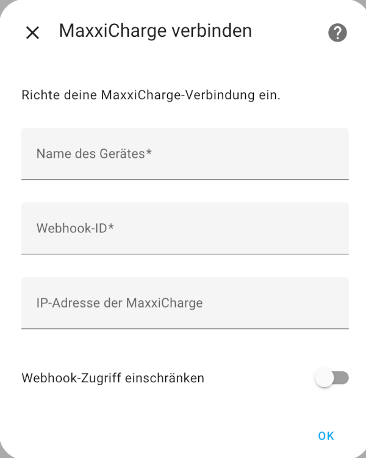

# 🛠️ Installation

Über HACS (Empfohlen):

- HACS installieren
In HACS → Integrationen → Drei-Punkte-Menü → Benutzerdefiniertes Repository hinzufügen
URL: https://github.com/mephdrac/MaxxiChargeConnect
Typ: Integration
- *MaxxiChargeConnect*  installieren
- Home Assistant neu starten
- Integration in den Einstellungen hinzufügen

## Manuell
- Repository klonen oder ZIP herunterladen
- Inhalt in das Verzeichnis custom_components/maxxi_charge_connect kopieren
- Home Assistant neu starten
- Integration wie gewohnt 

## Einrichten auf Maxxicharge
Zunächst muss in der maxxisun.app unter Cloudservice "nein" eingestellt ist. Und die Einstellung für "Lokalen Server nutzen" auf "Ja" steht.

Dort muss eine API-Route noch vergeben sein. Z.B.:

```
http://**dein_homeassistant**/api/webhook/**webhook_id**
```

# Einrichten der Integration

Zunächst über HACS installieren (siehe [Installation](# 🛠️ Installation))

Danach ein Gerät hinzufügen und es erscheint folgender Dialog:



## Name des Gerätes
Der Name des Gerätes ist frei wählbar und es ist ein muss Feld.

## Webhook-ID
Die **webhook_id** ist frei vergebbar und ein muss Feld.

Nachdem die Integration über HACS installiert ist. Kann ein Gerät eingerichtet werden. Für die Einrichtung ist es notwendig eine **webhook_id** anzugeben. Diese **webhook_id** ist die zuvor in der Api-Route verwendete **webhook_id**. Danach ist die Integration eingerichtet.

## IP-Adresse der MaxxiCharge
Es ist ein optionales Feld, welche auch leer bleiben kann. Allerdings sind dann nur die Felder in der Integration aktiv, die per Webhook mit Daten versorgt werden

Für alle weiter führenden Sensoren ist die IP-Adresse notwendig. Und auch, wenn der Zugriff auf den bei Home Assistant für diese Integration eingerichtete Webook auf eine IP-Adresse beschränkt werden soll.

# Webhook-Zugriff einschränken

Default ist: Nein

- Nein == Es findet keine Einschränkung des Zugriffs auf den Webhook statt. Hier gelten ausschließlich die Einschränkungen, die Home Assistant vorgibt.
- Ja == Zusätzlich zu den Einschränkungen des Webhooks durch Home Assistant wird zusätzlich noch auf die IP-Adresse gefiltert. D.h. nur das Gerät mit der IP-Adresse (die unter IP-Adresse der MaxxiCharge angegeben wurde) kann auf diesen Webhook dieser Integration zugreifen.

**Wichtig:** Ist "Ja" gewählt, so muss eine IP-Adresse angeben werden.

